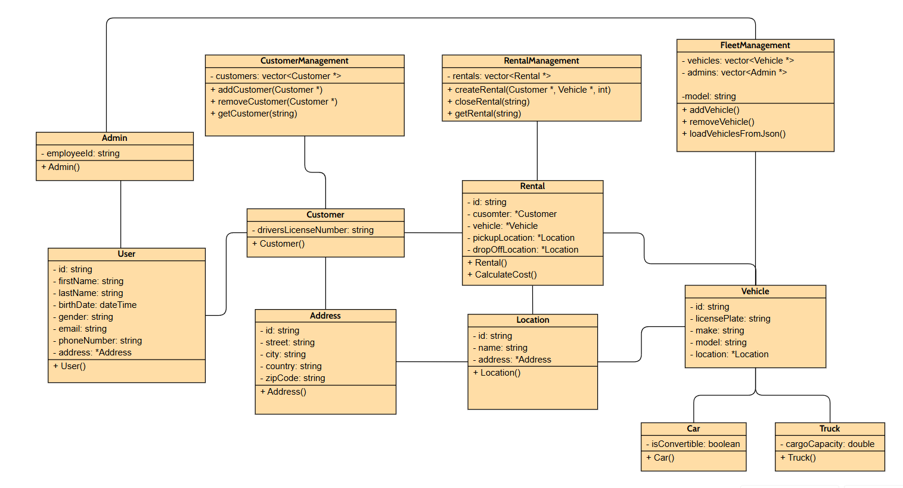

# Symulator Wypożyczalni Aut

   * [Autorzy](#autorzy)
   * [Technologie](#technologie)
   * [Opis Projektu](#opis-projektu)
      * [Interfejs Użytkownika](#interfejs-użytkownika)
      * [Symulacja](#symulacja)
   * [Instrukcja obsługi](#instrukcja-obsługi)
   * [Struktura Plików](#struktura-plików)
   * [Roadmap](#roadmap)
   * [Demonstracja](#przykładowa-demonstracja-symulatora)
   * [Diagram UML](#wstępny-diagram-uml)

## Autorzy
 - **Mateusz Lewko**: @mlewko
 - **Jerzy Muszyński**: @jmuszyns

## Technologie
   - **Język Programowania**: C++
   - **Biblioteki/Frameworki**: Standard Template Library (STL), Nlohmann/Json, Random, Chrono, Cmath, Google Test
   - **Przechowywanie Danych**: Przykładowe dane do symulacji przechowywane w folderze ``data`` w postaci plików .json
   - **System Budowy**: CMake

## Opis Projektu
Celem projektu jest stworzenie aplikacji w języku C++, która symuluje działanie wypożyczalni samochodów. Aplikacja będzie umożliwiać zarządzanie flotą pojazdów, klientami oraz procesem wypożyczania i zwracania samochodów. Projekt można podzielić na dwie części, **[interfejs użytkownika](#interfejs-użytkownika)** oraz **[symulacje](#symulacja)**.

### Interfejs Użytkownika
<hr>
Intefejs pełni rolę pośrednika między użytkownikiem a systemem wypożyczalni samochodowej. Zapewnia interakcję poprzez prosty interfejs tekstowy w konsoli, umożliwiając klientom wypożyczenie i zwrot pojazdów oraz przeglądanie dostępnych opcji.

#### Działanie:

- Wyświetlanie Menu: Interfejs prezentuje użytkownikowi główne menu, gdzie może wybrać odpowiednią opcję.

- Obsługa Wyboru Użytkownika: Po wybraniu opcji przez użytkownika, interfejs przekazuje odpowiednie żądanie do systemu wypożyczalni, aby obsłużyć akcję.

#### Wypożyczenie Samochodu:
- Użytkownik może wybrać opcję wypożyczenia samochodu. Interfejs umożliwia wybór lokalizacji, określenie czasu trwania wypożyczenia oraz wybór pojazdu zgodnie z preferencjami.

#### Zwrot Samochodu:
- Po zakończeniu wypożyczenia, użytkownik może dokonać zwrotu samochodu. Interfejs prezentuje aktualne informacje o wypożyczeniu i prosi użytkownika o potwierdzenie.

#### Wyświetlanie Dostępnych Opcji:
- Interfejs pozwala użytkownikowi na przeglądanie dostępnych lokalizacji, pojazdów oraz informacji o aktualnym wypożyczeniu.

### Symulacja
<hr>
Symulacja w projekcie Wypożyczalni Samochodów odgrywa kluczową rolę w testowaniu i analizie codziennej pracy systemu, została oparta przede wszystkim na losowości zapewnionej przy pomocy biblioteki ``<random>`` oraz zarządzaniu __wirtualnym__ zegarem przy pomocy biblioteki ``<chrono>``

#### Inicjalizacja Symulacji:

- Symulacja rozpoczyna się od inicjalizacji, gdzie wczytywane są dane z plików JSON, ``Simulation::loadData()`` takie jak klienci, adresy, lokalizacje, pojazdy itp.
- Dane te są wykorzystywane do utworzenia obiektów klientów, adresów, lokalizacji i pojazdów, które są później używane w symulacji.

#### Pojedyncza Iteracja Symulacji:

- Po inicjalizacji następuje uruchomienie pętli głównej, ``Simulation::run()``, która wykonuje określoną liczbę iteracji symulacji.
- W każdej iteracji symulacji losowo generowani są nowi klienci oraz nowe wynajmy.
- Następnie sprawdzane są warunki, które powodują zakończenie wynajmów, takie jak upłynięcie czasu trwania wynajmu.
- Symulacja obsługuje także inne zdarzenia, takie jak planowana konserwacja pojazdów, zgłaszanie wypadków czy aktualizacja danych klientów.

#### Zarządzanie Czasem:

- Symulacja kontroluje upływ czasu, przesuwając aktualną datę o 2 godziny w każdej iteracji, ``Simulation::passTime()``.
- Aktualizacja czasu jest wykorzystywana do planowania różnych operacji, takich jak zakończenie wynajmu po upływie określonego czasu.

#### Generowanie Logów:

- W trakcie symulacji generowane są logi zawierające informacje o wykonywanych operacjach, takich jak rejestracja nowych klientów, otwieranie nowych wynajmów, zakończenie wynajmów, rozpoczęcie i zakończenie konserwacji pojazdów, zgłaszanie wypadków itp.
- Logi te są wyświetlane na standardowym wyjściu i przechowywane w pamięci symulacji, ``Simulation::printLogs()``.

#### Raporty:

- Po zakończeniu symulacji generowane są raporty, ``SimulationReport`` zawierające podsumowanie różnych aspektów działania systemu.
   1. Podsumowanie Klientów: Informacje o zarejestrowanych klientach:
      - łączna liczba wynajmów
      - łączna długość wynajmów (hr)
      - srednia długość wynajmów (hr)
      - łączne koszta wynajmów ($).

   2. Podsumowanie Pojazdów: Informacje o zarządzanych pojazdach:
      - łączna liczba wypożyczeń
      - łączna liczba napraw
      - łaczny przejechany dystans (km)
      - liczba napraw


#### Zakończenie Symulacji:

- Po zakończeniu określonej liczby iteracji, symulacja kończy swoje działanie i generuje raporty dotyczące działalności systemu, takie jak podsumowanie klientów czy podsumowanie pojazdów, ``SimulationReport::GenerateCustomerSummary()`` oraz ``SimulationReport::GenerateVehicleSummary()``.


## Instrukcja obsługi

#### Przygotowanie środowiska

Najpierw należy sklonować repozytorium na własną maszynę i przejść do głównego katalogu projektu

```bash
git clone https://gitlab-stud.elka.pw.edu.pl/jmuszyns/24l-proi-lewko-muszynski.git
cd 24l-proi-lewko-muszynski
```

Następnie trzeba utworzyć konieczne zależności i konfiguracje budowania projektu. Można to zrealizować za pomocą Visual Studio Code, bądź w konsoli, używając poniższych poleceń

```bash
mkdir build
cd build
cmake ..
make
cd ..
```

#### Uruchomienie projektu
Zawsze przed uruchomieniem wybranej części projektu, upewniamy się, że znajdujemy się w głównym katalogu ``~/24l-proi-lewko-muszynski$``, a następnie wykonujemy wybrane polecenia

- W przypadku **Symulacji**
```bash
./build/car_rental_simulation
```

- W przypadku **Interfejsu użytkownika**
```bash
./build/car_rental
```

- W przypadku **Testów jednostkowych**
```bash
./build/car_rental_tests
```

## Struktura Plików
```
├── CMakeLists.txt
├── README.md
├── data
├── figures
│   └── diagram.png
├── main.cpp
├── simulation.cpp
├── src
│   ├── address
│   ├── admin
│   ├── car
│   ├── customer
│   ├── fleet
│   ├── location
│   ├── rental
│   ├── simulation
│   ├── truck
│   ├── user
│   ├── userInterface
│   └── vehicle
├── tests
└── utils
```

## Roadmap

- [x] Praca nad interfejsem użytkownika - @mlewko #3
- [x] Praca nad symulacją systemu, klasa ``Simulation`` - @jmuszyns #4
- [x] Implementacja klas projektu
   - [x] Wstępny wybór i implementacja klas - @mlewko
   - [x] Refaktoryzacja i dalsza praca - @jmuszyns
   - [x] Implementacja klas dziedziczących ``User`` & ``Admin`` #1 - @jmuszyns
   - [x] Implementacja klas dziedziczących ``Car`` & ``Truck`` #1 - @jmuszyns
   - [x] Modyfikacja klas ``Vehicle`` & ``Customer`` #1 - @all
   - [x] Implementacja klasy ``userInteface`` #3 - @mlewko
- [ ] Implementacja testów jednostkowych
   - [x] Wstępne testy obecnie używanych klas - @jmuszyns
   - [ ] Dalsza praca nad weryfikacją różnych scenariuszy - @mlewko
- [x] Obsługa wyjątków
   - [x] W obrębie symulacji - @jmuszyns
   - [x] W obrębie interfejsu użytkownika - @mlewko
- [~] wydajne zarządzanie wskaźnikami (unique pointers) #2
- [x] dokumentacja - @all
- [~] Implementacja interfejsu graficznego

## Przykładowa demonstracja symulatora

Przykładowa demonstracja (zawiera niepełny przebieg symulacji, jedynie jej przykładowe fragmenty)

```
Enter the number of simulations: 10

Simulation has just started

Fri Jun  7 05:05:03 2024

1. New customer registered: Penny D'Alessandro - pdalessandro16@biblegateway.com
2. New rental opened: Gerard Coppo - gcoppo4@slate.com rented
        Vehicle: Mitsubishi License Plate: WO76011 Rental Rates: 42.9$
        Location ID: 1 Name: Spenser
        Address: Mifflin Street Plei Kần
        Duration: 9 hours
3. New rental opened: Penny D'Alessandro - pdalessandro16@biblegateway.com rented
        Vehicle: Mazda License Plate: WL65327 Rental Rates: 16.25$
        Location ID: 82 Name: Dawn
        Address: Buhler Street Araçatuba
        Duration: 3 hours
4. Accident reported for: Vehicle: Mitsubishi License Plate: WX78405 Rental Rates: 24.92$
        Location ID: 69 Name: Cherokee
        Address: Mallory Street Nuevo Arraiján
5. Rental terminated after an accident: Caleb Richford - crichford1a@w3.org
6. Maintenance after an accident Vehicle: Mitsubishi License Plate: WX78405 Rental Rates: 24.92$
        Location ID: 69 Name: Cherokee
        Address: Mallory Street Nuevo Arraiján
        To be repaired by Admin: Emile Wardale ID: 2efba389-fff5-48db-882a-b99e0fdef8eb

Fri Jun  7 09:05:03 2024

1. Rental closed: Penny D'Alessandro - pdalessandro16@biblegateway.com returned
        Vehicle: Mazda License Plate: WL65327 Rental Rates: 16.25$
        Location ID: 82 Name: Dawn
        Address: Buhler Street Araçatuba
        Total Cost: 48.75 $
        Duration: 3 hours
        Distance: 160.78 km
2. Rental closed: Caleb Richford - crichford1a@w3.org returned
        Vehicle: Nissan License Plate: WI87174 Rental Rates: 10.98$
        Location ID: 95 Name: Carpenter
        Address: Crowley Street Saint-Lambert-de-Lauzon
        Total Cost: 21.96 $
        Duration: 2 hours
        Distance: 705.84 km
3. Scheduled maintenance for Vehicle: Mazda License Plate: WB61999 Rental Rates: 44.83$
        Location ID: 89 Name: North
        Address: Heath Street Dammarie-les-Lys
        To be repaired by Admin: Joycelin Prestedge ID: d9bb7418-3d08-4fa6-8501-edda66d94b23
4. Finished maintenance for: Vehicle: Mitsubishi License Plate: WP43062 Rental Rates: 29.69$
        Location ID: 6 Name: Spaight
        Address: Arizona Street Otse
        Maintained by Admin: Jobie Dictus ID: fae6ad1a-41c7-4984-a7e4-3934e24ae50c
5. Updated data for: Caleb Richford - Caleb.Richford84@example.com
        Old email: crichford1a@w3.org
        New email: Caleb.Richford84@example.com

Fri Jun  7 19:05:03 2024

1. New customer registered: Zita Nunson - znunson22@chronoengine.com
2. New rental opened: Zita Nunson - znunson22@chronoengine.com rented
        Vehicle: Mazda License Plate: WL65327 Rental Rates: 16.25$
        Location ID: 74 Name: Cascade
        Address: Main Street Itapaci
        Duration: 5 hours

Simulation has ended after 10 iterations

Customer Summary Report
-------------------------
Customer: Gerard Coppo - gcoppo4@slate.com
Total Rentals: 2
Total Cost: 685.32$
Total Rental Duration: 15.00 hours
Average Rental Duration: 7.50 hours
-------------------------
Customer: Caleb Richford - Caleb.Richford84@example.com
Total Rentals: 3
Total Cost: 296.16$
Total Rental Duration: 12.00 hours
Average Rental Duration: 4.00 hours
-------------------------
Customer: Zita Nunson - znunson22@chronoengine.com
Total Rentals: 1
Total Cost: 81.25$
Total Rental Duration: 5.00 hours
Average Rental Duration: 5.00 hours
-------------------------

Vehicle Summary Report
--------------------
Vehicle: Mitsubishi License Plate: WO76011
Total Rentals: 1
Total Maintenance Count: 1
Total Accident Count: 1
Total Mileage: 172.62 km
--------------------
Vehicle: Ford License Plate: WZ64963
Total Maintenance Count: 1
--------------------
Vehicle: Mitsubishi License Plate: WX78405
Total Rentals: 1
Total Maintenance Count: 1
Total Accident Count: 1
Total Mileage: 192.96 km
--------------------
Vehicle: Mitsubishi License Plate: WP43062
Total Maintenance Count: 1
--------------------
```


## Wstępny diagram UML



